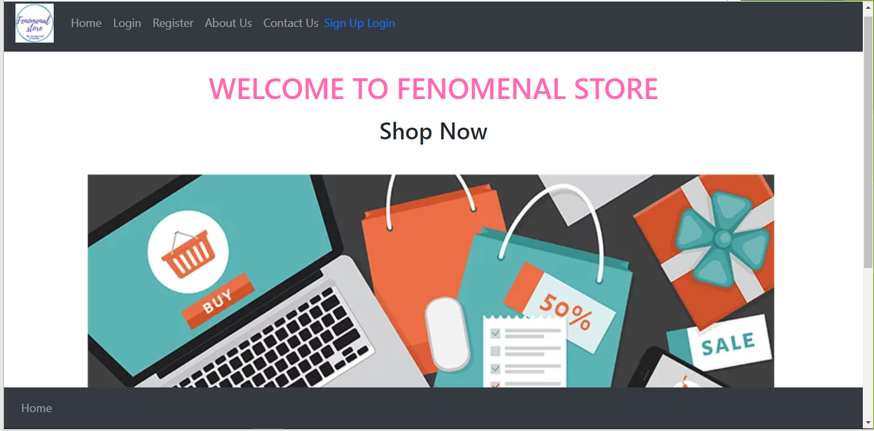
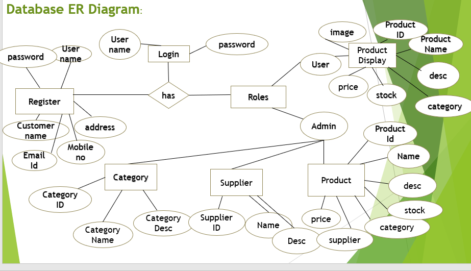

# Fenomenal Store

```
Language : Java
Framework : Spring
IDE : Eclipse
```




# About:
The purpose of this project is the products can be sold online.A person sitting on his/her chair can access all the facilities of the internet to buy and sell the products.
Unlike traditional commerce that is carried out physically with effort of a person to go and get products, ecommerce has made it easier for human to reduce the effort.

# Installation and Architectural Design
Install the Eclipse IDE. At the backend Configuration class, DAO implementation classes and DAO test is implemented and testing is done using JUnit test case.
At the front end the controller classes are implemented like Category Controller,User Controller,Product Controller, Supplier Controller and front end is deployed on the server.


# ER diagram:



# Testing:
- JUnit should be first option when testing the java applications. JUnit can be used separately or integrated with build tools like Maven.
- During the process of testing the applications developers may face many problems. The flow of an application cannot be tested only using main() method. For example, for a web application if we want to test the flow we need to deploy it on the server and if there is a change in java code the application should be restarted again therefore testing time is increased.
- JUnit can solve all these issues of testing. JUnit is used to test an actual class. Using JUnit we can save testing time.
- JUnit has become a standard for testing in Java programming language and it is supported by almost all the IDE’s.
- JUnit is one of the best testing frameworks that can be selected for an efficient testing process.

# Future Enhancement
The project can be extended to allow multiple images when user clicks on the product.
Can also include video for that particular product .
The current system is confined only to shopping cart process. It can be extended to have an easy to check out process.
Can improve security level. Making application more secure and reliable.
Project can be upgraded to more advance option such as sort date wise, location wise etc.
